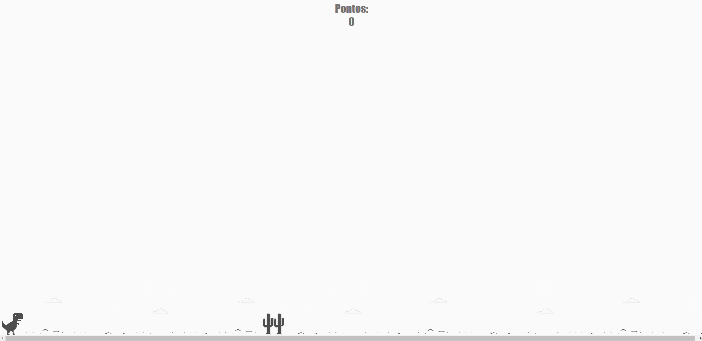
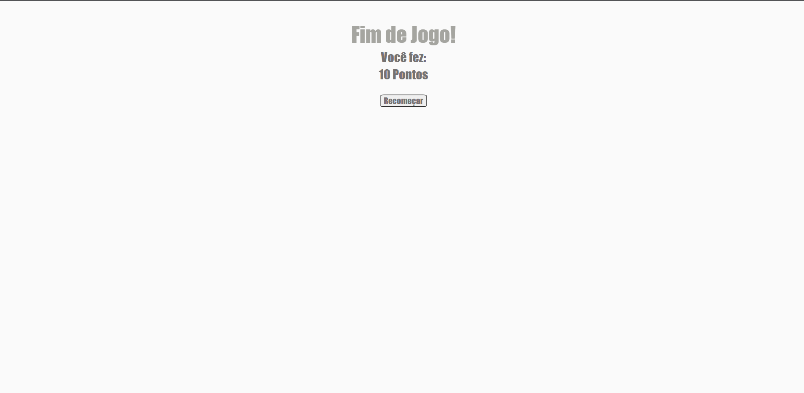

# Clone Jogo do Dinossauro / Dinossaur Game Clone

## Descrição / Description

Olá, este é um clone do famoso jogo do dinossauro do navegador Google Chrome, feito para o bootcamp Philips, 'You are You' da [Digital Innovation One](https://www.dio.me/);

Hello, this is a clone of the famous dinossaur game, from Chrome Web Browser; made to the bootcamp Philips, 'You are You' from [Digital Innovation One](https://www.dio.me/);

## Tecnologias e Linguagens / Technologies and Languages

Na concepção desse projeto, foram usadas as seguintes tecnologias e linguagens:

To create this project, I used the following languages and technologies:

* HTML 5;
* CSS 3;
* Vanilla JavaScript;

## Funcionalidades Adicionais / Additional Features

Além do requerido no desafio, foram acrescentadas as funcionalidades de contar pontos e de reiniciar o jogo através de um botão na tela de Game Over;

In addition to what is required in the challenge, the functionality of counting points and restarting the game through a button on the Game Over screen has been added;

## Imagens do Projeto

### Durante o Jogo / During the Game

### Tela de Fim de Jogo / Game Over Screen

